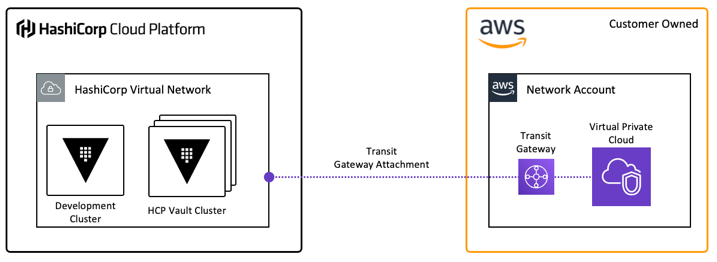

# hcp-vault-aws-tgw-module

This module is designed to provision a HashiCorp Virtual Network as well as a new HCP Vault cluster. Connectivity from the HCP environment is done using a Transit Gateway.

Since most organizations already have an established network strategy, or the network stack is defined in another Terraform configuration, this module assumes the following:
* The VPC in the targeted account (Network account) already exists
* The Transit Gateway in the targeted account (Network account) already exists
* A private route table exists for the VPC in the targeted account

An [example .tfvars file](https://github.com/btkrausen/hcp_vault_aws_tgw/blob/main/examples/terraform.tfvars.example) is included to configure values of required variables.

 

